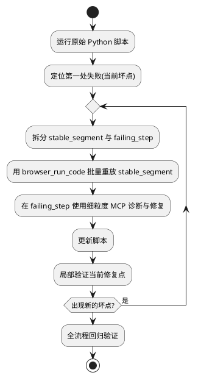
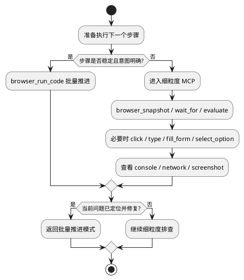
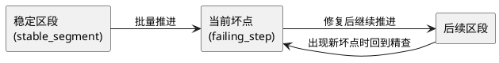
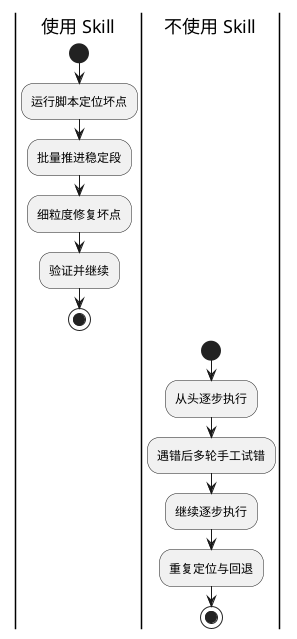

# playwright-fixwmcp Skill 使用说明

## 1. 这个 Skill 做的事

`playwright-fixwmcp` 是一个用于**修复失败的 Python Playwright 脚本**的执行型 Skill。

它的核心不是“全程细粒度手动点页面”，而是采用一种混合策略：

- 先运行原始脚本，定位**当前坏点**
- 坏点之前的稳定步骤用 `browser_run_code` 批量重放
- 到坏点后切换到细粒度 MCP 工具做精查与修复
- 修完继续推进，遇到新坏点再重复

目标：

- 更快穿过稳定区段
- 在真正有风险的地方停下来分析
- 以更少调用次数完成脚本修复和验证

---

## 2. 典型输入与输出

### 输入

- 必需：失败的 `.py` Playwright 脚本
- 可选：traceback、截图、trace 文件、日志、URL、登录说明

### 输出

- 修复后的脚本（或最小补丁）
- 修复报告（建议包含）：
  - 总结
  - 当前坏点
  - 本轮批量重放范围
  - 细粒度发现
  - 脚本修改
  - 验证情况
  - 剩余风险

---

## 3. 总体流程（宏观）

---

## 4. 工具切换流程（微观决策）

---

## 5. 关键编排：稳定段 vs 坏点

---

## 6. 有这个 Skill 与没有这个 Skill 的区别

## 6.1 调试策略差异

| 维度 | 使用 `playwright-fixwmcp` | 不使用该 Skill（常见手工方式） |
|---|---|---|
| 调试入口 | 先复现并明确“当前坏点” | 可能直接从头逐步点，坏点定义不稳定 |
| 稳定步骤处理 | 批量重放（`browser_run_code`） | 往往也逐步执行，调用次数高 |
| 失败步骤处理 | 细粒度工具精查，针对性强 | 可能粗放重试，定位慢 |
| 调试节奏 | 批量推进 ↔ 精查切换 | 常常全程同一种粒度，效率低 |
| 问题闭环 | 修一个坏点就验证并继续 | 可能反复在同一层级试错 |
| 可复用性 | 有固定编排模板，容易复用 | 更依赖个人经验，不易标准化 |

## 6.2 效率与风险差异（经验层面）

- 使用 Skill：
  - 对长流程脚本更友好
  - 减少对稳定步骤的重复劳动
  - 更容易形成结构化修复报告
- 不使用 Skill：
  - 容易在稳定步骤消耗大量时间
  - 调试过程碎片化，回溯和复盘成本更高

---

## 7. 两种方式的对照流程图

---

## 8. 推荐的执行守则

1. 不把可疑失败步骤藏进大段 `browser_run_code`。
2. 只在“稳定且意图明确”时批量推进。
3. 每修复一个坏点都做局部验证，再继续。
4. 出现新坏点时，重复同一编排，不要切回全程盲调。

---

## 9. 一句话总结

`playwright-fixwmcp` 的价值在于：**把调试资源集中到“真正会失败的点”上，同时让稳定流程快速通过**，从而在复杂 UI 自动化脚本中显著提升修复效率与可复用性。
