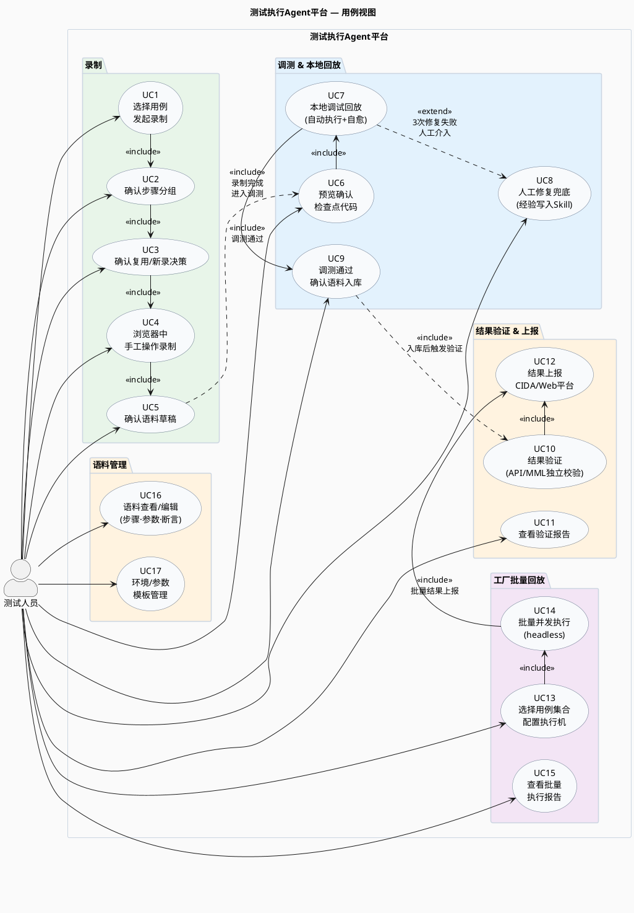
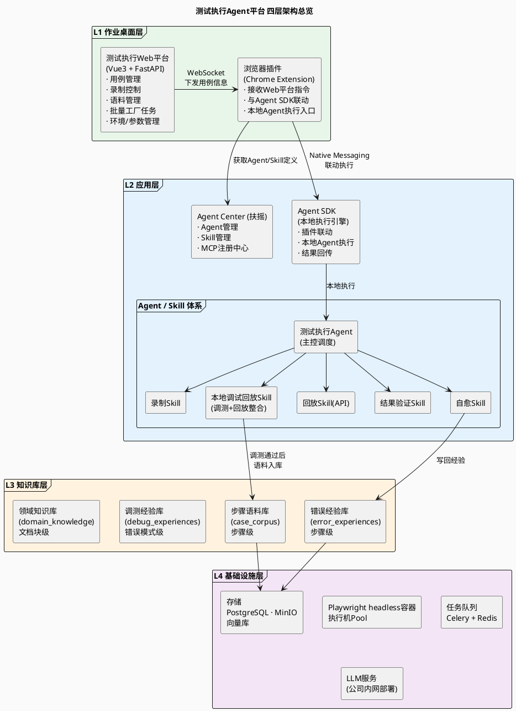
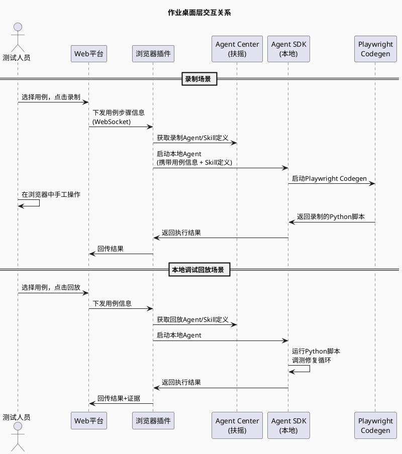
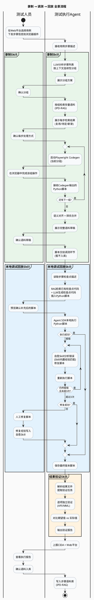
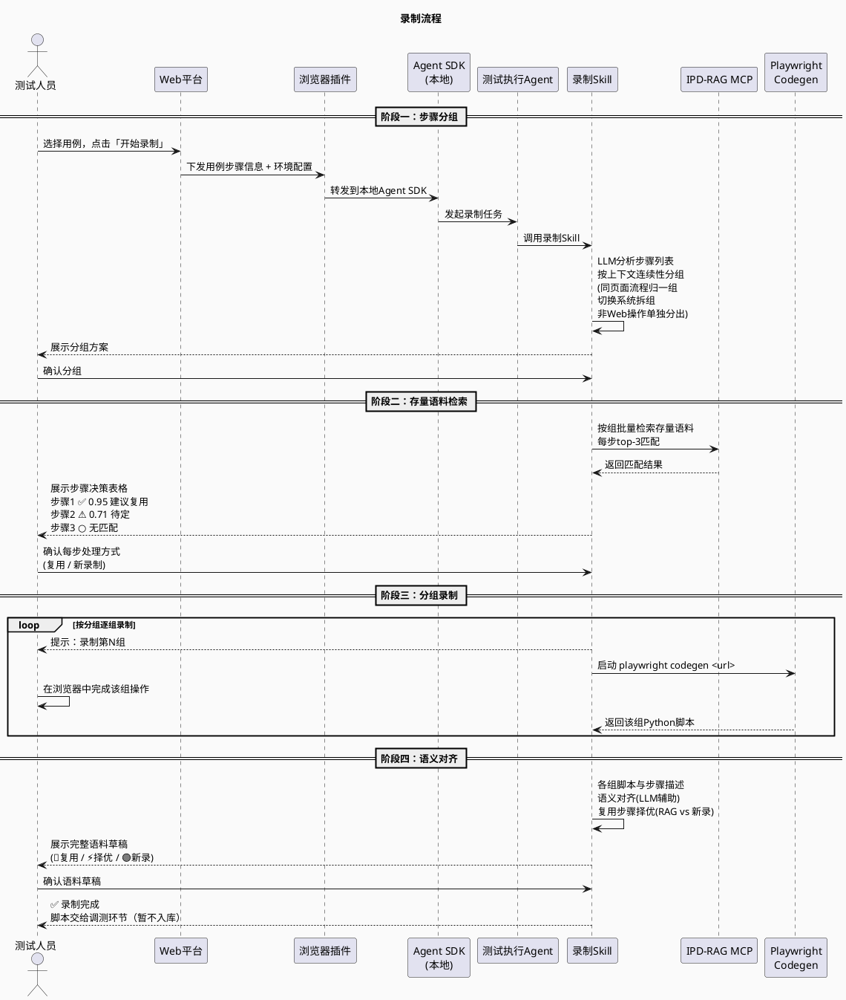
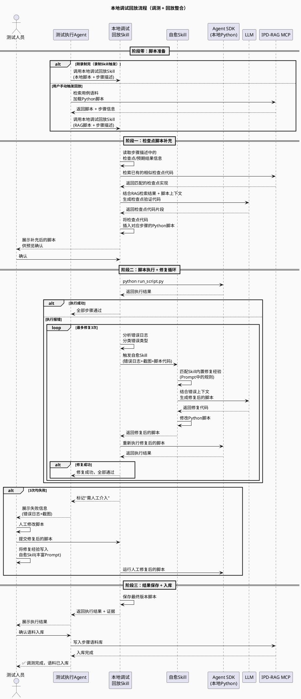
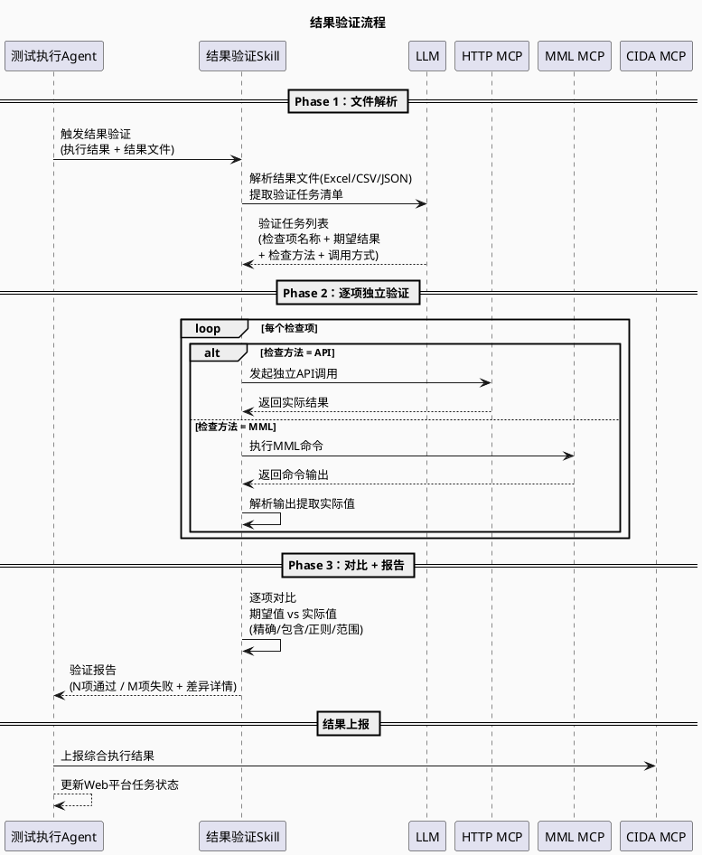
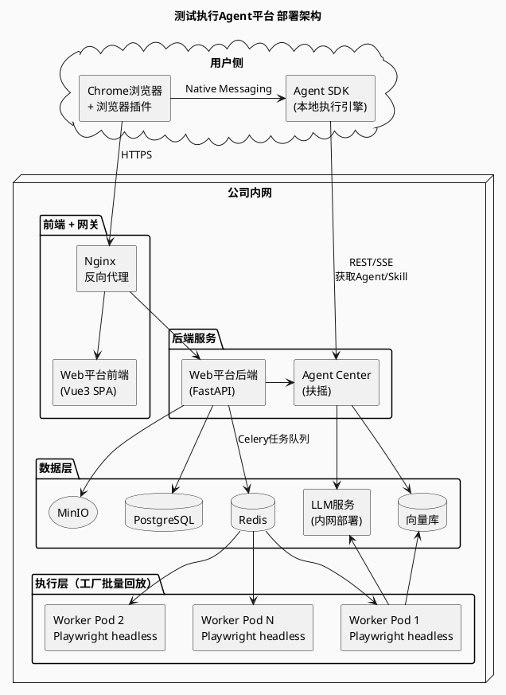

# 测试执行Agent平台 设计方案 V3

---

## 一、项目背景与目标

### 1.1 背景与痛点

当前测试团队虽已在大量场景中实现 Python 自动化测试，但仍存在相当比例的手工用例，主要涵盖以下几类核心痛点：

| 痛点类型 | 典型场景描述 |
|---------|------------|
| API未对外开放 | Web平台API不开放，只能浏览器手动操作 |
| 自动化成本高/低频高成本 | API复杂，团队不愿写脚本或仅首版本手测；自动化收益远低于开发成本 |
| 变更频繁维护难 | 界面/接口频繁变动，自动化脚本维护成本极高 |
| 半自动化用例 | 用例中某步骤无法自动化，导致整链路需人工执行 |
| 结果判断复杂 | 需查阅多个wiki/文本才能判断Pass/Fail |
| 参数不固定 | 测试场景/参数动态变化，脚本泛化难度高 |
| 知识壁垒高 | 领域知识需积累，新人上手慢 |

### 1.2 项目目标

| 维度 | 目标描述 |
|-----|---------|
| 用例维度 | 存量手工用例转为AI可执行；增量用例首版本自动化率提升 |
| 质量维度 | AI辅助执行覆盖更广，发现更多问题 |
| 效率维度 | 手工连跑时间大幅缩短 |
| 工具维度 | 打通测试生态，一站式作业 |

### 1.3 核心场景

| 场景类型 | 典型案例 | 技术特征 | 复杂度 |
|--------|---------|---------|-------|
| Web类手工用例 | 浏览器操作Web管理平台、配置界面等 | 无对外API；界面变动频繁；需视觉+DOM理解 | 高 |
| API类手工用例 | 复杂REST/RPC接口调测，含鉴权、参数组合等 | 有API文档；参数组合多；结果判断复杂 | 中 |
| MML类手工用例 | SSH登录网元设备执行MML/CLI命令 | 非浏览器操作；交互式命令；输出格式不固定 | 中 |

## 二、需求分析

### 2.1 用户场景分析

| 层级 | 环节             | 动作                                                         | 工程诉求                                          |
| ---- | ---------------- | ------------------------------------------------------------ | ------------------------------------------------- |
| L1   | 环境准备         | 选择用例对应的网元环境、执行环境，并占用                     | —                                                 |
| L2   | 用例意图识别     | 用例步骤拆解                                                 | —                                                 |
|      | 用例录制         | 用户在真实浏览器中完成一次手工操作，系统自动录制完整行为链，并存入执行序列资产库 | —                                                 |
|      | 用例结果判定     | 基于用例观察点进行用例执行结果判定                           | —                                                 |
|      | 用例错误自愈     | 新用例、页面变化引起的执行错误，调整执行序列                 | —                                                 |
|      | 单用例调试、回放 | 用户选中用例，在本地浏览器中触发一次回放，实时观察执行过程   | —                                                 |
| L3   | 新用例生成       | 新用例基于历史**步骤语料**（步骤级 RAG 检索，case_corpus）和**用例结构参考**（用例级相似度检索，case_index），生成可执行序列，调试/自愈后入库 | —                                                 |
| L4   | 工厂批量回放     | 制定版本、特性下批量手工用例，下发到分布式集群批量执行，并完成结果上报 | 错误自愈 + 自动重试；会话管理、缓存管理；执行报告 |

### 2.2 工程能力分析

| 层级 | 名称         | 服务阶段                         |
| ---- | ------------ | -------------------------------- |
| L1   | 用户入口     | 用例管理、执行资产管理           |
| L2   | 浏览器驱动层 | 环境准备、录制底座、回放执行引擎 |
| L3   | AI增强层     | 智能录制、人工调测、错误自愈     |
| L4   | Agent编排    | 调试、编排Agent                  |
| L5   | 工程化底座   | 工厂批量回放                     |

### 2.3 业界洞察

#### 2.3.1 业界常见开源工具

| 层     | 名称             | 主要工具                                                     | 核心价值                               |
| ------ | ---------------- | ------------------------------------------------------------ | -------------------------------------- |
| **L1** | **用户入口**     | 见下一章                                                     | 用户界面                               |
| **L2** | **浏览器驱动层** | Playwright · Selenium · Puppeteer                            | 跨浏览器DOM控制、CDP协议、网络拦截     |
| **L3** | **AI增强层**     | Stagehand · browser-use · Playwright MCP · BrowserWing · OpenClaw · Crawl4AI · Crawlee | 自然语言驱动、AI错误自愈、场景泛化     |
| **L4** | **Agent编排层**  | 扶摇（公司内部）· LangGraph · MCP · Agent Skills / ClawHub   | 多步骤工作流编排、记忆管理、工具调用   |
| **L5** | **工程化底座**   | puppeteer-cluster · playwright-cluster · Crawlee · Crawl4AI · Celery · Playwright Grid · Playwright Trace · Allure | 并发调度、会话管理、证据链、分布式执行 |

#### 2.3.2 入口形态总览

| 入口形态        | 典型产品                                             | 目标用户       | 核心优势                                   | 核心限制                 |
| --------------- | ---------------------------------------------------- | -------------- | ------------------------------------------ | ------------------------ |
| **CLI / SDK**   | Playwright、Selenium、Puppeteer、browser-use         | 开发者         | 完全可控、可编程、可集成 CI                | 无 GUI，需写代码         |
| **浏览器扩展**  | Selenium IDE、Axiom.ai、Ui.Vision、Browser MCP       | 测试/运营人员  | 零安装、共享登录态、所见即所得录制         | 沙箱限制、无法后台运行   |
| **桌面客户端**  | UiPath Studio、Power Automate Desktop、Katalon       | 企业 RPA 用户  | 全桌面权限、可访问 native 应用、流程可视化 | 重量级、平台绑定、价格高 |
| **Web 管理台**  | BrowserStack、Selenoid UI、Testim、Mabl              | 测试团队负责人 | 无需本地环境、多人协作、报告集中           | 依赖网络、本地调试弱     |
| **AI IDE 内嵌** | Playwright MCP（Claude/Cursor/Copilot）、BrowserWing | AI 开发者      | 与代码编辑器无缝融合、MCP 协议统一接入     | 非独立产品，依附宿主工具 |

#### 2.3.3 具体对比

##### 2.3.3.1 浏览器驱动

| 对比维度            | Playwright ⭐                                   | Selenium WebDriver                        | Puppeteer                                               |
| ------------------- | ---------------------------------------------- | ----------------------------------------- | ------------------------------------------------------- |
| **定位**            | 全能底座，AI 生态首选                          | 遗产项目兼容                              | Chrome 专项轻量脚本                                     |
| **出品方**          | Microsoft（2020）                              | Selenium 社区（2004）                     | Google Chrome DevTools 团队                             |
| **语言支持**        | JS/TS/Python/Java/C#                           | Java/Python/C#/Ruby/JS/Kotlin（最广）     | 仅 JS/TypeScript                                        |
| **浏览器支持**      | Chromium/Firefox/WebKit 三引擎                 | Chrome/Firefox/Safari/IE/Edge（最广）     | 仅 Chromium/Chrome                                      |
| **执行速度**        | 快（直连 CDP）                                 | 慢约30%（HTTP中间层）                     | 最快（直连 CDP，短脚本）                                |
| **等待机制**        | ✅ Auto-wait 内置，零配置                       | ❌ 手动 sleep/retry，flaky 高发            | ❌ 无 Auto-wait，需手写逻辑                              |
| **会话并发**        | ✅ BrowserContext 原生隔离并行                  | ⚠️ 需 Grid 或第三方库                      | ⚠️ 需 puppeteer-cluster                                  |
| **录制能力（1.1）** | ✅ 内置 Codegen，生成语义定位器                 | ❌ 无内置录制                              | ❌ 无内置录制                                            |
| **调试能力（1.2）** | ✅ Trace Viewer：步骤截图+DOM快照+网络          | ❌ 无内置 Trace                            | ❌ 无内置 Trace                                          |
| **分布式（1.3）**   | ✅ 内置 --workers + Sharding                    | ✅ Selenium Grid 4（K8s 原生）             | ⚠️ 需 puppeteer-cluster                                  |
| **Electron 支持**   | ⚠️ 支持但不如 Puppeteer 原生                    | ❌ 不支持                                  | ✅ 最佳（直连调试端口）                                  |
| **AI 生态**         | ✅ 最丰富（Stagehand/browser-use/MCP 均基于此） | ⚠️ 需额外配置（Healenium 等）              | ⚠️ 仅限 JS 生态                                          |
| **驱动维护**        | ✅ 内置，无需手动管理                           | ⚠️ selenium-manager 已缓解，仍有成本       | ✅ 内置                                                  |
| **镜像体积**        | ~300MB+/浏览器                                 | 轻量（不含浏览器二进制）                  | ~170MB（仅 Chromium）                                   |
| **开源/费用**       | MIT 免费                                       | Apache 2.0 免费                           | Apache 2.0 免费                                         |
| **适用场景**        | 所有新项目首选；AI Agent 驱动测试；CI/CD 集成  | 存量 Java/.NET 遗产项目；需支持老旧浏览器 | Chrome 专项；Electron 桌面应用；已有 Puppeteer 存量项目 |


##### 2.3.3.2 AI增强

###### 录制与转化工具对比

| 对比维度         | Playwright Codegen                      | rrweb                                                | BrowserWing                             |
| ---------------- | --------------------------------------- | ---------------------------------------------------- | --------------------------------------- |
| **定位**         | 操作录制→脚本生成                       | DOM 级完整行为录制                                   | 录制→MCP/Skill 一键导出                 |
| **核心机制**     | 监听浏览器事件，生成 Playwright 脚本    | MutationObserver 捕获全量 DOM 变更，输出 JSON 事件流 | 可视化录制 + 26+ HTTP 控制端点          |
| **输出格式**     | Playwright 可执行脚本                   | JSON 事件流（需转换层）                              | MCP Server 配置 / SKILL.md              |
| **定位器质量**   | ✅ 优先语义定位器（getByRole/getByText） | N/A（非脚本，是录像）                                | ✅ LLM 语义提取                          |
| **AI 工具接入**  | ⚠️ 需手动转换后接入                      | ⚠️ 需额外转换层                                       | ✅ 直接导出为 Claude/Cursor/MCP 可用格式 |
| **生产环境嵌入** | ❌ 仅开发/测试环境                       | ✅ 可嵌入生产，采集真实用户行为                       | ❌ 仅本地录制                            |
| **Bug 复现**     | ⚠️ 脚本级，需人工验证                    | ✅ 像素级重放，复现率高                               | ⚠️ 依赖脚本精度                          |
| **隐私保护**     | N/A                                     | ✅ 密码默认脱敏，支持黑名单屏蔽，GDPR 友好            | ⚠️ 需自行配置                            |
| **存储需求**     | 极小（代码文件）                        | ⚠️ 数据量大，需规划存储方案                           | 极小（配置文件）                        |
| **非技术用户**   | ❌ 生成代码偏程序员风格                  | ⚠️ 需运维支撑                                         | ✅ 可视化界面，无需写代码                |
| **复杂交互**     | ⚠️ 拖拽/Canvas/iframe 嵌套有限制         | ⚠️ Canvas/WebGL 有限制                                | ⚠️ 复杂动态页面有待验证                  |
| **技术栈**       | 内置于 Playwright（JS/TS/Python）       | 纯 JS 库，任意前端框架                               | Go 单二进制，跨平台                     |
| **开源/费用**    | MIT 免费（Playwright 内置）             | MIT 免费                                             | MIT 免费                                |
| **成熟度**       | ✅ 高（Playwright 官方）                 | ✅ 高（14k+ Stars，Sentry/PostHog 在用）              | ⚠️ 较新，社区规模小                      |

###### Playwright 生态对比

`playwright-crx` 是基于 Playwright 的 Chrome 扩展运行时（Chrome Extension Runtime），它将 Playwright 的控制能力嵌入到用户真实浏览器会话中，无需额外启动独立浏览器进程。

| 对比维度                 | Playwright Codegen（独立进程）         | playwright-crx（扩展模式）⭐                  |
| ------------------------ | -------------------------------------- | -------------------------------------------- |
| **登录态共享**           | ❌ 独立进程，无法共享用户已登录的会话   | ✅ 直接复用当前 Tab 的 Cookie/Session         |
| **录制入口**             | ❌ 需要命令行，测试人员需要装 Node 环境 | ✅ 浏览器扩展安装即用，Web 控制台一键触发     |
| **与被测系统隔离**       | ❌ 代理注入，部分 CSP 严格系统会被拦截  | ✅ 同源扩展，无跨域问题                       |
| **事件捕获粒度**         | ✅ Playwright 原生 CDP 事件             | ✅ CDP + 扩展 Content Script 双通道           |
| **回放执行**             | ✅ 全功能                               | ✅ 通过 Background Service Worker 驱动        |
| **无头执行（工厂模式）** | ✅ headless 原生支持                    | ⚠️ 工厂批量执行切换为标准 Playwright headless |
| **用户学习成本**         | 高（CLI/SDK）                          | 低（可视化扩展）                             |

> 💡 **架构决策**：用户录制阶段使用 `playwright-crx` 扩展（共享真实 Session，操作即所见即录），工厂批量回放阶段切换为标准 `Playwright headless`（高并发，无头执行）。两个阶段共用同一套录制资产格式，无缝衔接。

###### LLM 驱动执行 Agent 对比

| 对比维度           | Stagehand ⭐                         | browser-use                    | Playwright MCP                      | OpenClaw                                 |
| ------------------ | ----------------------------------- | ------------------------------ | ----------------------------------- | ---------------------------------------- |
| **定位**           | 精确控制与自治之间的黄金中间地带    | Python 极简 LLM 浏览器 Agent   | 将 Playwright 封装为 MCP Server     | 消息平台触发的自主 Agent                 |
| **语言**           | TypeScript                          | Python                         | 语言无关（MCP 协议）                | Node.js（触发端任意平台）                |
| **底层驱动**       | Playwright（v3 直连 CDP）           | Playwright                     | Playwright                          | Playwright CDP                           |
| **LLM 上下文**     | Accessibility Tree（低噪音）        | HTML + 截图（多模态）          | Accessibility Tree 快照（低 Token） | AI 快照（多种格式可选）                  |
| **操作方式**       | act / observe / extract 三原语混用  | 自然语言描述全自动执行         | AI 工具调用（MCP Tools）            | 消息平台发送指令触发                     |
| **控制精度**       | ✅ 高（代码+自然语言灵活混用）       | ⚠️ 低（完全 Agent，非确定性）   | ✅ 中（Snapshot 确定性强）           | ⚠️ 低（完全 Agent 模式）                  |
| **AI 自愈**        | ✅ 内置，定位失败自动修复            | ✅ LLM 语义推断新位置           | ⚠️ 依赖 LLM 推断，无专用自愈机制     | ⚠️ 依赖 LLM，不稳定                       |
| **动作缓存**       | ✅ 相同元素跳过重复 LLM 推理         | ❌ 无                           | ❌ 无                                | ❌ 无                                     |
| **Token 消耗**     | 低（Accessibility Tree 精简）       | 高（全 HTML+截图）             | 低（Snapshot 模式）                 | 中                                       |
| **多模型支持**     | ✅ Claude/GPT/Gemini                 | ✅ 全模型                       | ✅ 全模型                            | ✅ 全模型                                 |
| **1.2 单用例调试** | ✅ 推荐（精确+自愈）                 | ✅ 适用                         | ✅ 适用（AI 工具调用方式）           | ⚠️ 探索阶段，不稳定                       |
| **1.3 批量回放**   | ✅ 推荐（配合 playwright-cluster）   | ✅ 适用（配合 Celery）          | ❌ 不适合大规模批量                  | ❌ 不适合批量                             |
| **CI/CD 集成**     | ✅ 完整                              | ✅ 完整                         | ⚠️ 无内置 assert/report              | ❌ 无                                     |
| **触发方式**       | 代码调用                            | 代码调用                       | MCP 工具调用                        | WhatsApp/Telegram/Slack 消息             |
| **安全风险**       | 无                                  | 无                             | 无                                  | ⚠️ ClawHavoc 供应链攻击（CVE-2026-25253） |
| **开源/费用**      | MIT 免费（云端用 Browserbase 付费） | MIT 免费                       | MIT 免费                            | MIT 免费（⚠️ 公开 Skills 有安全风险）     |
| **成熟度**         | ✅ 高（周下载 50万+，生产验证）      | ✅ 高（58k+ Stars，社区最活跃） | ✅ 高（Microsoft 官方）              | ⚠️ 创始人已离开，维护存不确定性           |

##### 2.3.3.3 工程化底座

###### 并发调度工具对比（可能不需要）

| 对比维度         | Playwright 内置 Workers   | playwright-cluster             | puppeteer-cluster             | Playwright Grid（自建） | Celery + Redis                                         |
| ---------------- | ------------------------- | ------------------------------ | ----------------------------- | ----------------------- | ------------------------------------------------------ |
| **语言**         | JS/TS/Python              | TypeScript                     | JavaScript                    | 多语言                  | Python                                                 |
| **底层驱动**     | Playwright                | Playwright                     | Puppeteer                     | Playwright              | Playwright（Worker 内）                                |
| **并发模型**     | BrowserContext 进程内并行 | Worker Pool                    | PAGE/CONTEXT/BROWSER 三模式   | 多机器分布式            | 多进程分布式任务队列                                   |
| **会话隔离**     | ✅ BrowserContext 完全隔离 | ✅ Context 级隔离               | ✅ CONTEXT 模式完全隔离        | ✅ 进程级完全隔离        | ✅ 进程级完全隔离                                       |
| **失败重试**     | ✅ 内置 retry + flaky 标记 | ✅ maxRetries，失败自动重入队列 | ✅ retryLimit，事件驱动重试    | ⚠️ 需配合 CI 系统        | ✅ max_retries + retry_backoff（指数退避）              |
| **定时触发**     | ❌                         | ❌                              | ❌                             | ❌                       | ✅ Beat 内置 Cron 调度                                  |
| **任务链**       | ❌                         | ❌                              | ❌                             | ❌                       | ✅ Chain（采集→生成→执行→报告）                         |
| **跨机器扩展**   | ❌ 单机                    | ❌ 单机                         | ❌ 单机                        | ✅ K8s/多机              | ✅ K8s 横向扩展（Prefork Pool）                         |
| **监控内置**     | ⚠️ 基础统计                | ⚠️ 基础统计                     | ✅ 并发数/成功率/队列长度      | ⚠️ 需外部监控            | ✅ Celery Flower 实时监控                               |
| **Broker 依赖**  | ❌ 无需                    | ❌ 无需                         | ❌ 无需                        | ⚠️ 需 CI 协调            | ⚠️ 需 Redis/RabbitMQ                                    |
| **Windows 支持** | ✅                         | ✅                              | ✅                             | ✅                       | ❌ v4+ 不支持                                           |
| **Gevent 兼容**  | N/A                       | N/A                            | N/A                           | N/A                     | ❌ **禁止使用 Gevent Pool**（与 Playwright async 冲突） |
| **配置复杂度**   | 低（--workers 参数即可）  | 低-中                          | 低-中                         | 高                      | 高（需部署 Broker）                                    |
| **推荐并发规模** | ≤50（单机入门）           | 20–100（单机中等）             | 20–100（单机中等）            | 100+（跨机器）          | 50–500+（分布式）                                      |
| **开源/费用**    | MIT 免费                  | MIT 免费                       | MIT 免费                      | MIT 免费                | BSD 免费                                               |
| **适用场景**     | Phase 1 入门；CI 环境批量 | TS 团队中等规模 1.3            | 已有 Puppeteer 存量项目扩并发 | 超大规模跨机器分布      | Python 团队大规模 1.3；定时/Pipeline 场景              |

###### 可观测性与证据链

| 对比维度        | Playwright Trace Viewer                 | Allure Report                      |
| --------------- | --------------------------------------- | ---------------------------------- |
| **追踪对象**    | 浏览器行为（步骤级）                    | 测试执行结果                       |
| **服务阶段**    | 1.2 调试核心；1.3 失败溯源              | 1.3 汇总报告                       |
| **证据内容**    | 步骤截图 + DOM 快照 + 网络请求 + 时间线 | 步骤截图嵌入 + 历史趋势 + 缺陷链接 |
| **框架依赖**    | Playwright 内置，零配置                 | 语言无关（Java/Python/JS）         |
| **自托管**      | ✅（本地文件）                           | ✅                                  |
| **实时监控**    | ❌（事后分析）                           | ⚠️（CI 报告）                       |
| **Prompt 管理** | ❌                                       | ❌                                  |
| **数据合规**    | ✅ 本地                                  | ✅ 本地                             |
| **开源/费用**   | MIT 免费                                | Apache 2.0 免费                    |
| **适用场景**    | 所有项目必配，1.2 调试第一工具          | 所有项目必配，1.3 报告标准         |

#### 2.3.4 其他商业闭源产品参考

| 平台             | 定位                   | 核心差异化能力                                               | 相关开源组件                           | 备注                       |
| ---------------- | ---------------------- | ------------------------------------------------------------ | -------------------------------------- | -------------------------- |
| **BrowserStack** | 云端真实设备测试       | 3000+ 真实设备/浏览器组合；AI Test Observability（失败智能分组） | 无                                     | 企业跨设备兼容性测试首选   |
| **Browserbase**  | AI Agent 专用云浏览器  | Session Replay + Prompt Observability；CAPTCHA 自动处理；Stagehand 原生支持 | **Stagehand（开源 MIT）**              | Stagehand 生产部署推荐搭档 |
| **Testim**       | AI 自愈测试平台        | ML 多维度定位器；无代码录制；Tricentis 生态集成              | 无                                     | 高 UI 变更频率场景         |
| **QA Wolf**      | 全托管 AI 测试服务     | 手工用例→Playwright 脚本全自动转化；平台负责持续维护（含 UI 变更修复） | **输出标准 Playwright 代码（可迁出）** | 零维护成本，但价格高       |
| **Applitools**   | 视觉 AI 测试           | Visual AI 引擎（10年/40亿截图训练）；视觉缺陷检测准确率~95%  | **Eyes SDK 开源集成层**                | UI视觉质量要求高场景       |
| **Mabl**         | AI 测试 SaaS（端到端） | 低代码录制；ML 自愈定位；内置视觉测试；与 Jira/GitHub Actions 集成 | 无                                     | 非技术 QA 团队友好         |
| **Skyvern**      | 视觉+LLM Agent         | 不依赖 DOM 选择器，从截图理解页面；WebVoyager 基准 85.8%     | **开源 MIT（自部署可行）**             | 复杂 RPA 类场景备选        |

### 2.4 方案选型

| 阶段               | 层                | 推荐工具                                                     | 职责说明                                                     |
| ------------------ | ----------------- | ------------------------------------------------------------ | ------------------------------------------------------------ |
| **1.1 行为录制**   | L1 + L2           | Playwright Codegen + BrowserWing + rrweb（可选）             | Codegen 录制标准操作；rrweb 采集生产环境真实用户行为；BrowserWing 一键转为 MCP/Skill 格式 |
| **1.2 单用例调试** | L1 + L2 + L3      | Playwright + Stagehand/browser-use + Fuyao + Playwright Trace Viewer | Stagehand act/observe/extract 精确控制；动作缓存降低 LLM 成本；browser-use 定位失败时 LLM 语义推断；扶摇编排执行→报错→分析→重试；Trace Viewer 提供证据链 |
| **1.3 批量回放**   | L1 + L2 + L3 + L4 | Playwright + Stagehand + playwright-cluster + Celery（任务队列）+ Allure | 分布式任务下发；Worker 并发执行；Allure 汇总报告与 Trace 证据链 |

### 2.5 周边依赖

#### 周边平台

- AI辅助测试工具：TestMate、测试分析Agent、DTSGPT
- 数字化测试工具：CIDA、珊瑚、测试系统
- 业务相关工具：NTE、CSP、FMA等，详情见群空间表格

#### 资产

- 产品文档
- 业务相关工具 API 接口文档

---

## 三、整体工程架构

### 3.0 用例视图



### 3.1 四层架构总览

系统采用四层架构，从下到上依次为基础设施层、知识库层、应用层、作业桌面层。




**测试人员参与节点：**

| 阶段 | 序号 | 参与节点 | 说明 |
|------|:----:|---------|------|
| 录制 | ① | 确认步骤分组 | LLM自动分组后，人工确认分组方案 |
| 录制 | ② | 确认复用/新录决策 | 查看RAG检索结果，决定每步复用还是新录 |
| 录制 | ③ | 浏览器中手工操作录制 | 在Codegen启动后，于真实浏览器中完成操作 |
| 录制 | ④ | 确认语料草稿 | 查看语义对齐后的语料，确认无误 |
| 调测/回放 | ⑤ | 预览确认检查点代码 | 查看LLM+RAG生成的检查点代码，确认后执行 |
| 调测/回放 | ⑥ | 人工修复兜底 | 3次自动修复失败后人工介入，修复经验写入Skill |
| 调测/回放 | ⑦ | 确认入库 | 调测通过后确认语料写入知识库 |
| 验证 | ⑧ | 查看验证报告 | 查看结果验证Skill的通过/失败报告 |

### 3.2 作业桌面层（L1）

#### 3.2.1 测试执行Web平台

Web平台是测试人员的主作业入口，基于Vue3 + FastAPI构建，提供以下核心功能模块：

| 功能模块 | 核心功能 | 关键说明 |
|---------|---------|---------|
| 用例管理 | 展示TMSS用例树；用例资产状态概览；发起录制/回放 | 与TMSS双向同步（REST API + Webhook） |
| 录制控制 | 配置弹窗（环境选择、参数设置）；激活浏览器插件；实时步骤预览；状态控制（暂停/继续/结束） | 录制完成后自动跳转语料确认页 |
| 语料管理 | 步骤语料列表展示；步骤编辑（选择器、参数化、断言配置）；一键入知识库；AI执行结果管理 | 核心人工介入节点 |
| 批量工厂任务 | 选择用例集合；配置执行机；任务下发；实时监控进度；执行报告 | 执行机管理 + 结果分析 |
| 环境/参数管理 | 网元环境配置；执行环境配置；全局参数模板管理 | 支持参数化替换 |

#### 3.2.2 浏览器插件（Chrome Extension）

浏览器插件是Chrome扩展，是连接Web平台与用户本地执行能力的桥梁。它的核心职责不是直接录制（录制由Playwright Codegen完成），而是**接收任务信息并联动本地Agent SDK执行Agent**。

**核心能力：**

- 接收Web平台指令：通过WebSocket接收用例信息（步骤描述、环境配置等），作为Agent执行的输入
- 与Agent Center联动：从Agent Center获取Agent/Skill定义
- 与本地Agent SDK联动：将Agent任务下发到本地Agent SDK执行，解决Web端Agent Center无法操作用户本地资源（文件系统、本地浏览器等）的问题
- 结果回传：将Agent SDK的执行结果回传到Web平台

**解决的核心问题：** Agent Center部署在云端/服务器端，无法直接操作用户本地的浏览器、文件系统等资源。浏览器插件作为"桥梁"，接收云端的Agent/Skill定义，通过Agent SDK在用户本地执行，实现了"云端编排 + 本地执行"的架构。

#### 3.2.3 作业桌面层交互关系



### 3.3 应用层（L2）

应用层是系统的核心智能层，包含Agent Center、Agent SDK和完整的Agent/Skill体系。

#### 3.3.1 Agent Center（扶摇）

Agent Center是公司内部的Agent管理平台（类似扣子/Coze），提供以下能力：

- Agent管理：创建、配置、版本管理Agent
- Skill管理：Skill注册、参数配置、版本管理
- MCP注册中心：统一注册和管理各类MCP Server（Playwright MCP、HTTP MCP、MML MCP、CIDA MCP、IPD-RAG MCP等）
- 调用方式：Web平台通过REST/SSE调用Agent Center，Agent Center作为无状态AI决策服务

#### 3.3.2 Agent SDK（本地执行引擎）

Agent SDK是部署在用户本地的执行引擎（类似OpenCode/Claude Code形态），解决Agent Center在云端无法操作用户本地资源的问题。

**工作机制：**

1. 浏览器插件接收到Web平台下发的任务和Agent Center的Agent/Skill定义
2. 插件将任务转发给本地Agent SDK
3. Agent SDK在本地执行Agent逻辑（调用本地Playwright、操作本地文件、运行Python脚本等）
4. 执行结果通过插件回传到Web平台

**解决的核心问题：**

| 场景 | 无Agent SDK | 有Agent SDK |
|------|------------|------------|
| 操作本地文件（解压、上传等） | ❌ 云端Agent无法访问 | ✅ 本地直接操作 |
| 调用本地浏览器（headful模式） | ❌ 云端只能headless | ✅ 本地启动有头浏览器 |
| 运行录制的Python脚本 | ❌ 脚本在用户本地 | ✅ 本地直接python执行 |
| 访问内网受限系统 | ❌ 云端可能网络不通 | ✅ 用户网络直连 |
| 实时交互调试 | ❌ 延迟高，体验差 | ✅ 本地实时响应 |

#### 3.3.3 Agent设计——测试执行Agent

测试执行Agent是整个测试执行流程的调度中枢，负责任务规划、Skill调度和上下文管理。

**职责：**

- 接收用户指令（录制/调测/回放/批量执行），识别意图
- 规划执行计划：根据用例类型（Web/API/MML）选择对应Skill链路
- 调度Skill执行：按序调用各Skill，管理Skill间数据流转
- 异常处理：Skill失败时决定重试、降级或人工介入
- 状态上报：实时向Web平台推送执行进度

**Skill调度策略：**

测试执行Agent采用有限状态机（FSM）模式管理Skill调度，不同场景下的Skill链路如下：

| 场景 | Skill调度链路 |
|------|-------------|
| 用例录制（含新用例泛化） | 录制Skill → 本地调试回放Skill → 调测通过后语料入库 |
| 本地调试回放（Web） | 本地调试回放Skill（含调测+回放+自愈循环） → 结果验证Skill → 结果上报 |
| 本地调试回放（API） | 回放Skill(API) → 结果验证Skill → 结果上报 |
| 工厂批量回放 | 循环：{ 运行Python脚本 → [失败时]自愈Skill → 结果验证Skill } → 汇总上报 |

#### 3.3.4 Skill间串联与数据流转机制

Skill间通过**结构化上下文对象（Context Object）**传递数据。测试执行Agent维护一个全局Context，每个Skill从Context读取输入、将输出写回Context的约定字段。

**数据流转规则：**

| 源Skill | 传递内容 | 消费Skill |
|---------|---------|----------|
| 录制Skill | 录制生成的Python脚本（按分组，多个.py文件） | 本地调试回放Skill |
| 本地调试回放Skill | 步骤失败信息（错误类型、错误日志、截图、页面URL） | 自愈Skill |
| 自愈Skill | 修复后的脚本、修复策略记录 | 本地调试回放Skill（重新执行） |
| 本地调试回放Skill | 调测通过的脚本 + 语料 | 知识库（语料入库，调测通过后才写入） |
| 本地调试回放Skill | 全部步骤执行结果 | 结果验证Skill |
| 结果验证Skill | 验证报告（通过/失败/差异详情） | 测试执行Agent（决定最终状态） |
| 调测过程中的人工修复 | 修复经验（错误模式+修复方法） | 自愈Skill的Prompt（经验沉淀） |

**失败处理与状态流转：**

```
本地调试回放Skill执行Python脚本
    │
    ├── 脚本运行成功 → 进入结果验证
    │                    │
    │                    └── 验证通过 → 用户确认 → 语料入库
    │
    └── 脚本运行报错
          │
          ├── 自愈Skill介入（分析报错 → 修复脚本，经验在Skill Prompt中）
          │   ├── 修复成功 → 重新运行脚本（循环最多3次）
          │   └── 3次均失败 → 标记为"需人工介入"
          │
          └── 人工修复
              ├── 修改脚本使其通过
              └── 将修复经验写入自愈Skill（丰富Prompt）
```

#### 3.3.5 Skill详细设计

##### Skill总览

| Skill | 所属链路 | 触发时机 | 依赖的MCP/工具 |
|-------|---------|---------|--------------|
| 录制Skill | 录制 | 用户发起录制指令 | CIDA MCP, IPD-RAG MCP, Playwright Codegen(Shell) |
| 本地调试回放Skill | 调测+回放 | 录制完成后或用户发起回放 | Playwright（本地Python执行）, IPD-RAG MCP, LLM |
| 回放Skill(API) | 回放 | API类用例回放 | HTTP MCP, MML MCP, CIDA MCP |
| 结果验证Skill | 回放后 | 全部步骤执行完后 | HTTP MCP, MML MCP, LLM |
| 自愈Skill | 回放中 | 脚本运行报错时 | LLM（修复经验在Skill Prompt中） |

##### Skill 1：录制Skill

**目标：** 将手工用例的步骤描述转化为可执行的Python自动化脚本。

**触发条件：** 用户在Web平台选择用例并点击"开始录制"；新用例泛化也走此流程（已有步骤语料会被检索复用）。

**输入：** Web平台直接下发的用例步骤描述列表（含步骤编号、操作描述、预期结果）及环境信息。

**输出：** 按分组生成的多个Python脚本文件（.py），交给本地调试回放Skill进行调测。调测通过后才入库。

**执行阶段：**

阶段一：步骤分组
1. 接收Web平台下发的用例步骤描述和环境信息
2. LLM分析步骤列表，按上下文连续性分组：同一系统/页面流程归为一组（在同一个浏览器会话中操作），切换系统拆为不同组，非Web操作（API/MML）单独分出
3. 展示分组方案供用户确认

阶段二：存量语料检索
1. 用户确认分组后，按组调用IPD-RAG MCP检索存量语料
2. 每组内的每个步骤检索top-3匹配结果
3. 展示检索结果：高匹配度（≥0.85）建议复用、中等匹配度（0.7~0.85）待定、无匹配待录制
4. 用户确认每个步骤的处理方式（复用RAG语料 / 新录制）

阶段三：分组录制
1. 对每组中需要新录制的步骤，启动Playwright Codegen
2. 用户在浏览器中完成该组步骤的手工操作
3. 关闭浏览器后，Codegen输出该组对应的完整Python脚本
4. 复用步骤的已有脚本与新录制脚本合并为该组的最终脚本

阶段四：语义对齐
1. 将每组的Python脚本与原始步骤描述进行语义对齐（LLM辅助）
2. 语料择优：复用步骤比较RAG语料 vs 新录制——一致则沿用RAG，不一致则采用新录
3. 展示合并后的完整语料草稿（标注复用/择优/新录来源）
4. 用户确认后，将脚本交给本地调试回放Skill进行调测

**异常处理：**
- Codegen录制超时：提示用户检查操作是否完成
- 步骤对齐失败：将未对齐步骤标记为"待人工校对"
- RAG写入失败：重试3次，仍失败则保存本地草稿

##### Skill 2：本地调试回放Skill（调测 + 回放整合）

**目标：** 在用户本地运行Python脚本，补充检查点代码，遇到报错时自动修复，使脚本达到可稳定回放并通过结果验证的状态。调测通过后将语料写入知识库。

**设计理念：** 本地调试和回放本质上是同一个循环——"运行脚本 → 发现问题 → 修复 → 再运行"。因此将调测Skill和本地回放Skill整合为一个Skill，统一管理脚本执行、检查点补充和错误修复的全流程。

**触发条件：** 录制Skill完成后自动触发首次调测；或用户在Web平台手动发起本地回放。

**输入（两种来源）：**
- 刚录制完：直接使用录制Skill产出的本地Python脚本文件，无需从RAG检索
- 非刚录制（用户手动触发回放）：从RAG检索用例语料，加载对应的Python脚本后再调试回放

**输出：** 修复后的Python脚本文件；执行结果（含截图证据）；调测通过后语料入库。

**执行阶段：**

阶段零：脚本准备
- 如果是录制Skill刚完成触发：直接使用本地脚本，跳到阶段一
- 如果是用户手动触发回放：从IPD-RAG MCP检索用例语料，加载Python脚本到本地

阶段一：检查点脚本补充
1. 读取用例步骤描述中的检查点/预期结果信息
2. 从IPD-RAG MCP检索已有的相似检查点代码（已有用例中类似断言的实现）
3. 结合RAG检索结果和当前脚本上下文，由LLM生成检查点验证代码（如断言元素文本、验证页面状态等）
4. 将生成的检查点代码插入到对应步骤的Python脚本中
5. 展示补充后的脚本供用户预览确认

阶段二：脚本执行
1. 通过Agent SDK在用户本地执行Python脚本（`python run_script.py`）
2. 实时捕获执行日志和截图

阶段三：错误修复循环（最多3次）
1. 如果脚本执行报错，分析错误日志，分类错误类型
2. 自愈Skill根据Skill内置的修复经验（Prompt中的规则），自动修复脚本：
   - 元素超时/选择器失效：修改选择器、增加等待
   - 页面未加载完成：注入等待逻辑
   - 弹窗/遮罩干扰：增加关闭弹窗代码
   - 文件操作失败：调整文件路径
   - 检查点断言失败：调整断言逻辑或阈值
3. 用修复后的脚本重新执行（回到阶段二）
4. 最多循环3次

阶段四：结果处理与入库
- 3次内修复成功：
  - 将修复后的脚本保存为最终版本
  - 进入结果验证Skill
  - 验证通过后，用户确认，调用IPD-RAG MCP将语料写入知识库
- 3次均失败：标记为"需人工介入"，将失败信息上报Web平台
  - 人工修复完成后，将修复经验写入自愈Skill（丰富Prompt中的修复规则）
  - 人工修复后的脚本重新走调测流程

**当前经验沉淀方式与演进路径：**

| 阶段 | 存储方式 | 优点 | 缺点 |
|------|---------|------|------|
| 当前 | 调测Skill的Prompt中直接编写修复规则 | 简单直接，快速迭代 | 容量有限，不可检索，规则膨胀后Prompt过长 |
| 短期演进 | Prompt + 结构化规则文件（JSON/YAML） | Prompt保留高频规则，低频规则外置检索 | 需开发规则匹配逻辑 |
| 中期演进 | 独立调测经验库（向量库） | 可检索、可积累、可跨Skill复用 | 需额外基础设施投入 |

##### Skill 3：回放Skill（API类）

**目标：** 根据用例步骤信息，拼接HTTP/MML请求并执行，完成API类用例的自动化回放。

**触发条件：** 用户发起API类用例回放。

**输入：** 用例步骤信息（含操作类型、请求参数、预期结果）。

**输出：** 各步骤执行结果。

**执行阶段：**

阶段一：步骤解析
1. 获取用例步骤信息，识别每步的操作类型（HTTP请求 / MML命令）
2. 解析步骤中的参数模板，注入环境参数

阶段二：逐步执行
- HTTP类步骤：通过HTTP MCP发起GET/POST/PUT/DELETE请求，携带鉴权Token和请求体
- MML类步骤：通过MML MCP执行SSH命令，解析命令输出
- 链式调用：前一步骤的响应结果自动提取为后续步骤的输入参数

阶段三：结果上报
1. 校验每步响应（状态码、响应体字段值）
2. 调用CIDA MCP上报结果

##### Skill 4：结果验证Skill

**目标：** 在所有步骤执行完成后，通过独立渠道验证用例的业务结果正确性。

**触发条件：** 本地调试回放Skill或回放Skill(API)全部步骤执行完后，且用例配置了结果验证规则。

**输入：** 步骤执行结果，以及验证规则（可能来自导出的结果文件）。

**输出：** 验证报告。

**执行阶段：**

Phase 1：文件解析（LLM辅助）
- 解析导出的结果文件（Excel/CSV/JSON），提取验证任务清单
- 每项验证任务包含：检查项名称、期望结果、检查方法（API/MML）、具体调用方式

Phase 2：逐项独立验证
- API类检查项：通过HTTP MCP发起独立API调用获取实际值
- MML类检查项：通过MML MCP执行命令获取实际值

Phase 3：逐项对比
- 将文件中记录的期望值与独立验证获取的实际值逐项对比
- 支持精确匹配、包含匹配、正则匹配、数值范围校验
- 输出验证报告（N项通过/M项失败 + 差异详情）

##### Skill 5：自愈Skill

**目标：** 当Python脚本执行报错时，自动分析失败原因，修复脚本并支持重新执行。

**触发条件：** 本地调试回放Skill脚本执行报错时，由测试执行Agent触发。

**输入：** 错误日志、截图、当前脚本代码、页面URL。

**输出：** 修复后的脚本代码。

**自愈策略链（按优先级依次尝试）：**

| 优先级 | 策略 | 适用错误类型 | 实现方式 |
|:------:|------|------------|---------|
| 1 | Skill内置经验匹配 | 所有类型 | Skill Prompt中沉淀的修复规则（错误模式→修复方法），直接匹配并应用 |
| 2 | 多策略选择器降级 | element_not_found | ID → data-testid → role+text → CSS → XPath逐级降级修改脚本 |
| 3 | 等待策略调整 | timeout | 在脚本中插入waitForSelector / waitForLoadState / 增加超时时间 |
| 4 | OCR锚点定位 | Canvas/Webswing场景 | 直接坐标重试 → PaddleOCR区域验证 → 全屏OCR搜索ocr_anchor文本 → LLM视觉回退 |
| 5 | LLM通用修复 | 其他错误 | 将错误日志+脚本代码+页面截图提交LLM，生成修复方案 |
| 6 | 人工介入 | 以上均失败 | 通知用户人工修复，修复经验写回Skill Prompt |

**经验沉淀机制：** 自愈Skill的修复经验当前沉淀在Skill的Prompt中（规则直写）。人工修复成功后，将新的错误模式+修复方法补充到Prompt中，使Skill具备处理该类问题的能力。后续演进为结构化经验库。

**Webswing/Canvas场景特殊处理：**

对于Webswing渲染的Java Swing应用（单一Canvas元素，无DOM结构），自愈链路为：
1. 直接坐标点击（原始录制坐标）
2. PaddleOCR验证点击区域的文本是否匹配预期的ocr_anchor
3. OCR全屏搜索ocr_anchor文本，重新定位坐标
4. LLM视觉理解（截图+Prompt），推断目标位置
5. 人工介入

### 3.4 知识库层（L3）

#### 3.4.1 四类知识库设计

**存储粒度设计原则：** `case_corpus`以步骤为原子单元存储，每条记录对应一个操作步骤。步骤级存储是跨用例复用与泛化的基础。

| 知识库类型 | 存储粒度 | 存储内容 | 数据来源 | 更新策略 |
|---------|---------|---------|---------|---------|
| 步骤语料库（case_corpus） | 步骤级 | 步骤描述、操作动作、Python代码、断言/检查点代码、参数模板、OCR锚点、Embedding向量、成功率等 | 调测通过后，人工确认入库 | 实时增量；执行后更新成功率 |
| 错误经验库（error_experiences） | 步骤级 | 错误类型、失败原因、修复方法、步骤上下文、成功次数等 | 自愈成功后自动记录（当前在Skill Prompt中，后续迁移） | 每次修复后自动追加 |
| 调测经验库（debug_experiences） | 错误模式级 | 错误模式、修复策略、适用场景、代码片段、成功率等 | 调测修复成功后记录；人工修复后补充（当前在Skill Prompt中，后续迁移） | 逐步从Prompt迁移到结构化存储 |
| 领域知识库（domain_knowledge） | 文档块级 | API文档、Wiki知识页面、接口变更记录 | Swagger解析 + Confluence定期同步 | API变更时增量更新 |

**检索场景说明：**

| 检索场景 | 使用库 | 检索粒度 | 原因 |
|--------|-------|---------|------|
| 录制时找可复用操作 | case_corpus | 步骤级 | 需要原子组合，"点击保存"可跨用例复用 |
| 检查点补充时找已有断言实现 | case_corpus | 步骤级 | 类似检查点的代码可跨用例参考 |
| 回放时加载执行脚本 | case_corpus | 步骤级 | 按case_id批量拉取步骤语料和脚本 |
| 结果验证时获取判定知识 | domain_knowledge | 文档块级 | API文档、业务规则辅助验证判定 |

#### 3.4.2 数据飞轮机制

```
① 用户录制 ──→ ② 本地调试回放（调测） ──→ ③ 调测通过，语料入库
     ↑                                              │
     │                                              ↓
⑤ 新用例泛化 ←──── ④ 结果验证 + 自愈经验积累
```

- ①→②：Codegen录制产出Python脚本，直接进入调测环节
- ②→③：调测通过后，人工确认，语料写入知识库
- ③→④：执行过程中的自愈经验沉淀到Skill Prompt中
- ④→⑤：丰富语料驱动泛化成功率提升
- ⑤→①：新用例泛化与录制走同一流程，检索已有语料复用

### 3.5 基础设施层（L4）

| 组件 | 职责 | 技术选型 |
|------|------|---------|
| Playwright headless容器 | 浏览器自动化执行环境（工厂批量回放） | Playwright Docker镜像，单机4并发BrowserContext |
| 执行机Pool | 分布式执行节点 | K8s Pod / 物理机集群 |
| 任务队列 | 批量任务调度、失败重试、定时触发 | Celery + Redis（Prefork Pool，禁止Gevent） |
| 关系数据库 | 用例元数据、任务记录、用户配置 | PostgreSQL |
| 对象存储 | 脚本文件、截图证据、录制资产 | MinIO |
| 向量数据库 | 语料Embedding存储与检索 | 公司统一向量库服务 |
| LLM服务 | 语义增强、检查点生成、断言判定、自愈推理 | 公司内网部署大模型 |

---

## 四、核心流程设计

### 4.0 录制→调测→回放全景流程



### 4.1 录制流程



### 4.2 调测流程



### 4.3 结果验证流程



---

## 五、部署架构



---

## 六、总结

### 6.1 方案核心价值

| 价值维度 | 当前状态 | 目标状态 | 实现路径 |
|--------|---------|---------|---------|
| 执行效率 | 每版本大量人月人工执行 | 压缩至天级自动化执行（≥80%压缩） | 录制Skill + 本地调试回放Skill + 批量工厂化执行 |
| 用例资产 | 用例停留在Word/测试人员脑中 | 固化为可无限次稳定回放的数字资产 | 录制-语料管理-知识库-回放全链路 |
| 问题发现 | 人工执行覆盖面有限 | AI批量覆盖，提升问题发现率 | 结果验证Skill语义判定增强 |
| 知识传承 | 依赖老员工经验，新人上手慢 | 知识沉淀在知识库，新人可检索获取 | 数据飞轮持续积累 |
| 首版自动化率 | 首版本需大量手工执行 | AI辅助自动化率提升≥40% | RAG泛化 + 本地调试回放Skill |

---

## 附录A：Web类用例操作场景能力覆盖矩阵

### A.1 问题收敛方法论

当前面临的核心问题是"不知道问题全集在哪里，看不到头"。解决思路是：不逐个问题去解决，而是将所有问题归类到操作场景分类框架中，按类别给出统一技术方案。

**三档分类原则：**

- 第一档（已覆盖）：Playwright codegen可直接录制，脚本可直接运行，无需额外适配
- 第二档（需适配）：有明确技术方案但需开发适配逻辑，或需要调测Skill积累经验
- 第三档（暂不支持）：当前技术方案无法覆盖，需环境配合绕过或后续Phase扩展

### A.2 能力覆盖矩阵

#### 第一档：已覆盖（约60%场景）

这些场景Playwright codegen已能录制，生成的Python脚本可直接运行。

| L1大类 | L2中类 | 典型操作场景 | 录制 | 回放 |
|-------|-------|------------|:----:|:----:|
| 基础浏览器交互 | 页面导航 | URL直接访问、页面内锚点跳转、前进/后退、刷新、重定向跟随 | ✅ | ✅ |
| | 鼠标点击 | 单击元素、双击元素 | ✅ | ✅ |
| | 文本输入 | 普通文本输入、密码输入、内容清空 | ✅ | ✅ |
| | 键盘操作 | Tab切换焦点、Enter确认、Escape取消、方向键操作 | ✅ | ✅ |
| 表单与组件交互 | 下拉选择 | 原生select下拉 | ✅ | ✅ |
| | 复选/单选 | Checkbox勾选/取消、Radio切换、Switch开关 | ✅ | ✅ |
| | 日期时间 | 日期键盘直接输入（替代操作日期面板，更稳定） | ✅ | ✅ |
| | 树形控件 | 节点展开/折叠、节点选择、搜索过滤 | ✅ | ✅ |
| | 穿梭框 | 左右穿梭选择 | ✅ | ✅ |
| 表格与数据操作 | 表格基础 | 行选择（单选/多选）、全选/反选、行展开/折叠 | ✅ | ✅ |
| | 表格导航 | 分页翻页、排序切换、表格搜索 | ✅ | ✅ |
| | 行操作 | 行内操作按钮（编辑/删除/详情） | ✅ | ✅ |
| 弹窗与浮层 | 模态弹窗 | Modal对话框操作、确认/告警弹窗 | ✅ | ✅ |
| | 浮层 | Popover弹出面板、气泡确认框 | ✅ | ✅ |
| | 抽屉 | 侧边抽屉打开/关闭 | ✅ | ✅ |
| 文件操作 | 文件上传 | 标准input文件上传、多文件批量上传 | ✅ | ✅ |
| | 文件下载 | 点击下载/导出 | ✅ | ✅ |
| 页面等待 | 加载等待 | 页面整体加载等待、元素出现等待 | 自动 | ✅ |
| 特殊UI组件 | Tab/标签页 | Tab标签切换 | ✅ | ✅ |
| | 步骤条 | 多步骤向导、步骤回退修改 | ✅ | ✅ |
| 登录与鉴权 | 登录方式 | 用户名密码登录 | ✅ | ✅ |
| | 会话管理 | 登出操作 | ✅ | ✅ |
| API类操作 | REST API | GET/POST/PUT/DELETE、请求头设置、响应断言 | N/A | ✅ |

**统一技术方案：** Playwright codegen语义定位器录制 → 生成Python脚本 → 直接运行回放。URL/参数通过模板参数化。

#### 第二档：需适配（约25%场景）

这些场景有明确技术方案，但需要额外的适配开发或调测经验积累。

**2a. 自定义UI组件适配**

| L2中类 | 典型场景 | 难度 | 技术方案 |
|-------|---------|:----:|---------|
| 自定义下拉组件 | Ant Design/Element UI等自定义Select | 中 | 选择器需定位到选项层（通常挂载在document.body）；录制时记录选项面板的选择器路径 |
| 级联选择器 | 省/市/区三级联动 | 高 | 每级选择后注入waitForResponse等待下级数据加载；考虑直接fill输入框替代面板操作 |
| 可搜索下拉 | 输入关键词远程搜索后选择 | 高 | type逐字输入触发搜索 → waitForResponse等待结果 → 选择匹配项；处理debounce |
| 日期/时间选择器 | 日期面板操作 | 高 | 优先策略：直接fill日期输入框（更稳定）；备选：操作日期面板（需处理面板动态渲染） |
| Slider滑块 | 拖动滑块设定数值 | 高 | 存目标值，回放时通过JS设值（page.evaluate）而非模拟拖拽 |

**统一技术方案：** 调测Skill积累每类组件的处理模式（优先fill/type替代面板操作，辅以waitForResponse/waitForSelector等待异步加载）。

**2b. 页面等待与异步处理**

| 典型场景 | 难度 | 技术方案 |
|---------|:----:|---------|
| 接口请求完成等待 | 中 | 脚本中注入waitForResponse/waitForLoadState('networkidle') |
| 元素消失等待（Loading遮罩） | 中 | waitForSelector(loadingSelector, { state: 'hidden' })；NMS平台常见长时loading |
| 任务轮询/长任务等待 | 高 | 设置合理超时（可配置）+ 轮询间隔；ICT场景：部署/升级任务可能持续数分钟 |
| CSS动画/Transition完成 | 中 | waitForFunction检测动画结束 |
| 骨架屏消失 | 中 | waitForSelector(.skeleton, { state: 'hidden' }) |

**统一技术方案：** 调测Skill中沉淀等待策略，按错误类型自动在脚本中注入对应等待逻辑。

**2c. iframe与多窗口**

| 典型场景 | 难度 | 技术方案 |
|---------|:----:|---------|
| iframe内操作 | 中 | 脚本中使用frame_locator逐级进入 |
| 嵌套iframe | 高 | 递归frame_locator |
| 弹出窗口操作 | 中 | page.on('popup')捕获新窗口 |
| 新标签页/窗口打开 | 中 | context.on('page')监听新标签页 |

**统一技术方案：** 录制时自动识别iframe和多窗口上下文切换，生成对应的frame_locator/多page脚本代码。调测Skill处理遗漏的上下文切换。

**2d. 文件操作与本地资源**

| 典型场景 | 难度 | 技术方案 |
|---------|:----:|---------|
| 非标准上传组件 | 中 | 监听fileChooser事件：page.on('filechooser')自动设置文件路径 |
| 拖拽上传 | 高 | 构造DataTransfer对象通过page.evaluate注入 |
| 大文件/分片上传 | 高 | 延长超时配置；等待上传进度完成 |
| PC本地文件操作（解压等） | 高 | 拆分为独立步骤，由Agent SDK在本地执行（非浏览器步骤） |

**统一技术方案：** 浏览器内文件操作通过fileChooser API处理；浏览器外的本地文件操作（解压、移动等）通过Agent SDK本地执行，在脚本中拆分为独立的本地操作步骤。

**2e. 动态页面元素获取**

| 典型场景 | 难度 | 技术方案 |
|---------|:----:|---------|
| 页面动态元素获取（任务ID等） | 高 | 脚本中增加提取逻辑（page.text_content / page.evaluate）；或调用API查询获取 |
| 逐字符输入触发实时联想 | 中 | 用type逐字输入（而非fill），触发keydown/keyup事件和下拉联想 |
| 表格内联编辑 | 中 | 双击进入编辑态 → fill修改 → Enter退出 |
| 右键上下文菜单 | 中 | click({button: 'right'}) + waitForSelector(菜单选择器) |

**统一技术方案：** 需要从页面提取动态值的场景，由调测Skill在脚本中补充提取逻辑，提取的值注入后续步骤参数。

**2f. Canvas/Webswing场景**

| 典型场景 | 难度 | 技术方案 |
|---------|:----:|---------|
| Webswing渲染的Java Swing应用 | 极高 | 录制坐标 → 回放时page.mouse.click(x,y) + page.keyboard.type() |
| ECharts/Highcharts图表交互 | 高 | Canvas/SVG渲染，DOM选择器不适用；hover数据点通过坐标+evaluate实现 |

**统一技术方案：** 脚本中存储视口尺寸和OCR锚点文本。回放时强制视口尺寸一致，自愈链路：坐标重试 → PaddleOCR验证 → 全屏OCR搜索 → LLM视觉回退。

**2g. 断言与验证**

| 典型场景 | 难度 | 技术方案 |
|---------|:----:|---------|
| 元素文本断言 | 低 | 脚本中expect(locator).to_have_text() |
| 元素状态断言（可见/禁用/选中） | 低 | expect(locator).to_be_visible/disabled/checked |
| 数值范围/正则校验 | 中 | 结果验证Skill支持regex和范围表达式 |
| 跨页面/多系统数据一致性 | 高 | 结果验证Skill通过API/MML独立获取实际值进行交叉校验 |
| 通知/Toast捕获 | 中 | waitForSelector + 及时抓取（通知自动消失前） |

**统一技术方案：** 检查点代码由本地调试回放Skill的阶段一（检查点脚本补充）自动生成插入。复杂的跨系统校验由结果验证Skill独立完成。

**2h. 登录与会话**

| 典型场景 | 难度 | 技术方案 |
|---------|:----:|---------|
| SSO/CAS单点登录 | 高 | 优先通过API获取Token后注入Cookie |
| Session复用/Cookie注入 | 中 | 回放前通过storageState注入已有登录态 |
| Token刷新 | 中 | 长时间运行用例需监控Token有效性，自动刷新 |
| 多角色/多账号切换 | 高 | 同一用例多BrowserContext，每个Context独立Session |

**统一技术方案：** 优先Session复用（storageState注入），减少登录开销。SSO场景通过API获取Token后注入Cookie。

**2i. 网络拦截与Mock**

| 典型场景 | 难度 | 技术方案 |
|---------|:----:|---------|
| Mock API返回数据 | 中 | page.route()拦截特定请求返回Mock数据 |
| 延迟响应模拟 | 中 | route.fulfill()配合延时 |
| 请求阻断 | 低 | route.abort() |

**统一技术方案：** 需要Mock的场景，在脚本中增加page.route()注册Mock规则。

#### 第三档：暂不支持（约15%场景）

这些场景当前技术方案无法直接覆盖，需通过环境配合绕过或标记为后续Phase扩展。

| 典型场景 | 难度 | 处置策略 |
|---------|:----:|---------|
| 图形验证码 | 极高 | 协调测试环境关闭验证码或配置白名单 |
| 二因素认证(2FA/MFA) | 极高 | 协调测试环境豁免或通过API注入Session |
| 证书/USB Key登录 | 极高 | 无法自动化，通过API注入Session绕过 |
| PDF内嵌页面查看 | 极高 | 浏览器PDF Viewer无法DOM操作；替代：下载PDF后用脚本校验文件内容 |
| 视觉回归截图对比 | 中 | Phase 2+考虑引入视觉AI方向 |
| WebSocket实时数据验证 | 高 | 需判断数据何时更新到位；Phase 2扩展 |

### A.3 覆盖率统计

基于操作场景分类框架（135条场景）的覆盖率估算：

| 档位 | 场景数量（估） | 占比 | 状态 |
|------|:----------:|:----:|------|
| 第一档：已覆盖 | ~80 | 60% | 可直接使用 |
| 第二档：需适配 | ~35 | 25% | 有明确方案，需开发/积累 |
| 第三档：暂不支持 | ~20 | 15% | 环境配合绕过或后续扩展 |

**收敛路径：** Phase 1聚焦第一档（夯实基础），Phase 2攻克第二档高优先级场景（自定义组件、等待异步、文件操作），Phase 3+处理第二档长尾和评估第三档可行性。
